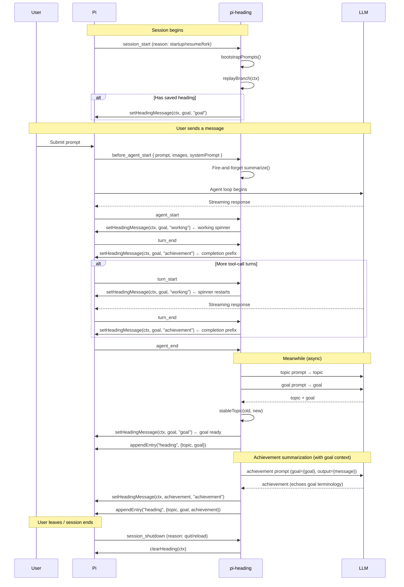

# @alexleekt/pi-heading

[](https://www.npmjs.com/package/@alexleekt/pi-heading)
[](LICENSE)

> Know where you are at a glance.

One-line session heading widget for the Pi coding agent.

Always know what you're working on — without scrolling back through tool calls and output.

## What it looks like

A single line above your editor, updated after every message you send:

**Goal locked in** — static prefix:
```
▸ Clean up that old chezmoi checkout
```

**Agent working** — animated Braille spinner:
```
⠋ Clean up that old chezmoi checkout
```

**Turn complete** — achievement shown with checkmark:
```
✓ Removed stale dotfiles and migrated to yadm
```

No borders. No panels. No ghosting. Just context.

> **Note:** Pi's built-in "Working…" loader is suppressed while the widget spinner is active, so there's only one motion source on screen at a time. Restored between turns.

## Features

| Feature | What it does |
|---------|-------------|
| **Auto-summarized heading** | After every user message, an LLM writes a one-sentence goal |
| **Stable topic** | A 2-4 word topic label that doesn't jitter between turns |
| **Per-branch memory** | Switch branches and the widget restores that branch's context |
| **Custom prompts** | Edit the LLM prompts that generate topics and goals |
| **Model override** | Use a cheaper/faster model for summarization |
| **Phase indicators** | `▸` for goal, `⠋` spinner while agent works, `✓` for achievement |
| **Zero ghosting** | Plain text widget — no border fragments to orphan |

## Installation

```bash
pi install @alexleekt/pi-heading
```

Or symlink for local development:
```bash
ln -s ~/git/pi-extensions/packages/pi-heading ~/.pi/agent/extensions/pi-heading
```

## Usage

### Automatic (default)

Just send a message. Within 1-3 seconds, the goal line appears. While the agent is generating, it spins. When the turn ends, a checkmark appears with the achievement summary.

```
help me set up docker for this project
→ ▸ Docker project setup          (goal ready)
→ ⠋ Docker project setup          (agent working)
→ ✓ Docker project setup          (turn complete — completion prefix)
→ ✓ Wrote Dockerfile and .dockerignore  (achievement summarized)
```

### `/heading` — manual override

Lock in a goal when the auto-summary isn't quite right:

```
/heading
→ (input dialog) Migrating from Docker to Kubernetes
→ ▸ Migrating from Docker to Kubernetes
```

### `/heading-model` — change the summarization model

```
/heading-model
→ Choose heading model
  [anthropic.claude-haiku-4-5]
  [anthropic.claude-sonnet-4-5]
  [Reset to session model]
```

By default, pi-heading uses your **session's configured model**. You can override to a cheaper one (e.g. Haiku, Flash, Mini) to keep costs near zero.

### `/heading-debug` — toggle debug logging

```
/heading-debug on     → Enable structured debug logging
/heading-debug off    → Disable debug logging
/heading-debug clear → Wipe the debug log
/heading-debug        → Show last 10 debug entries
```

When debug is on, every summarization call (topic, goal, achievement) is logged to a temp file with full prompts, raw responses, stream metadata, and any errors. Use this to diagnose missing headings or model failures.

## Customizing prompts

The LLM prompts live in:
```
~/.pi/agent/extensions/pi-heading/prompts/
├── topic.md
├── goal.md
└── achievement.md
```

Each file has YAML frontmatter with a `max_words` constraint:

```yaml
---
max_words: 4
---
Summarize the user's message as a concise topic label.

Output ONLY the topic label — no punctuation, no quotes, no explanation.

Message: {message}
```

- `{message}` — the agent's output text (required for all prompts)
- `{goal}` — the current goal text (available in `achievement.md` only)
- `max_words` is read from frontmatter and injected into the prompt; output is truncated if the LLM exceeds it

The **achievement** prompt receives both `{goal}` and `{message}` so the LLM can echo the goal's terminology in its summary.
- Edit these files, then `/reload` or restart Pi to pick up changes

Default prompts are auto-copied on first run if the files don't exist.

## Prompt evaluation (for developers)

If you're iterating on the prompts, use the evaluation CLI to measure quality before shipping.

### Evaluate prompts against test cases

```bash
cd ~/git/pi-extensions/packages/pi-heading

# Basic 8-case smoke test
bun tools/prompt-eval.ts topic
bun tools/prompt-eval.ts goal

# Comprehensive 50+ case test
bun tools/prompt-eval.ts topic-goal firepass test-cases-comprehensive.json
```

Reports are written to `tools/prompt-eval-report-*.md`.

### Iterative prompt optimization

Automatically rewrite the prompt until it hits a target pass rate:

```bash
bun tools/prompt-eval.ts optimize topic prompts/topic.md \
  "Concise 1-4 word noun phrases, no articles" \
  90 firepass test-cases-comprehensive.json
```

Arguments:
- `optimize` — run the optimization loop
- `topic|goal` — which suite to evaluate
- `prompts/*.md` — path to the prompt file to mutate
- `"desirable outcome"` — natural-language description of good output
- `90` — target pass rate percentage
- `firepass` — model for evaluation (optional, default: firepass)
- `test-cases-*.json` — test case file (optional)

How it works:
1. Evaluates the current prompt against all test cases
2. Collects failing cases and sends them to a critic LLM
3. Critic rewrites the prompt to fix the failure patterns
4. Prompt file is updated in-place
5. Re-evaluates — repeats until the target pass rate is reached or max iterations (5)

> ⚠️ **Back up your prompt first.** The optimizer mutates the file in-place.

## Architecture

```
User message
    ↓
before_agent_start hook (fire-and-forget)
    ↓
Parallel LLM calls:
  • topic prompt (max 4 words)
  • goal prompt  (max 12 words)
    ↓
Topic stability guard (prevents jitter)
    ↓
setHeadingMessage(ctx, goal, "goal")     ← goal phase (▸ prefix)
    ↓
agent_start event
    ↓
setHeadingMessage(ctx, goal, "working")  ← working phase (⠋ spinner)
    ↓
turn_end event
    ↓
Achievement LLM call:
  • prompt: {goal} + {message}  ← goal context biases wording
    ↓
setHeadingMessage(ctx, achievement, "achievement")  ← achievement phase (✓ prefix)
    ↓
appendEntry("heading", { topic, goal, achievement })  ← per-branch persistence
```

### Pi event lifecycle



**Key points:**
- `session_start` — restores heading from previous branch session (▸ or ✓)
- `before_agent_start` — triggers goal summarization (fire-and-forget)
- `agent_start` — starts the working spinner (⠋), suppresses Pi's default loader
- `turn_start` — restarts the spinner between tool-call turns (same agent run)
- `turn_end` — stops spinner, shows completion prefix (✓), triggers achievement summarization
- `agent_end` — restores Pi's default loader for the next agent run
- `session_shutdown` — clears the widget

## No ghosting — how?

The original `pi-recap` (by @Fornace, MIT licensed) used bordered panels with pi-tui components. Border characters would get orphaned in the terminal scrollback when the widget redrew. This version renders a **single plain-text line** via `ctx.ui.setWorkingMessage()` — no borders, no background colors, no custom components. Differential rendering naturally overwrites it in place.

## License

MIT
