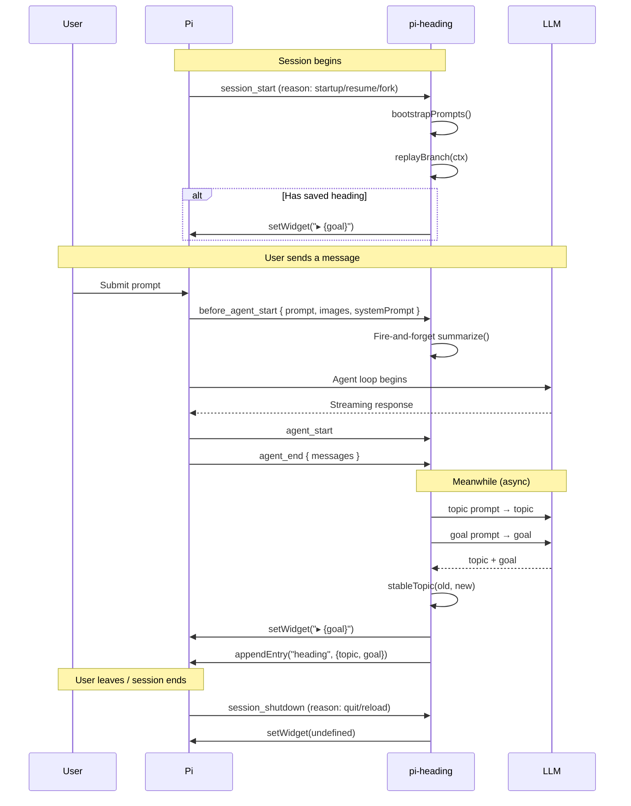

# @alexleekt/pi-heading

[](LICENSE)

**One-line session heading widget for the Pi coding agent.**

Always know what you're working on — without scrolling back through tool calls and output.

## What it looks like

A single line above your editor, updated after every message you send:

```
▸ Clean up that old chezmoi checkout
```

No borders. No panels. No ghosting. Just context.

## Features

| Feature | What it does |
|---------|-------------|
| **Auto-summarized heading** | After every user message, an LLM writes a one-sentence goal |
| **Stable topic** | A 2-4 word topic label that doesn't jitter between turns |
| **Per-branch memory** | Switch branches and the widget restores that branch's context |
| **Custom prompts** | Edit the LLM prompts that generate topics and goals |
| **Model override** | Use a cheaper/faster model for summarization |
| **Zero ghosting** | Plain text widget — no border fragments to orphan |

## Installation

```bash
pi install @alexleekt/pi-heading
```

Or symlink for local development:
```bash
ln -s ~/git/pi-extensions/packages/pi-heading ~/.pi/agent/extensions/pi-heading
```

## Usage

### Automatic (default)

Just send a message. Within 1-3 seconds, the goal line appears.

```
help me set up docker for this project
→ ▸ Docker project setup
```

### `/heading` — manual override

Lock in a goal when the auto-summary isn't quite right:

```
/heading
→ (input dialog) Migrating from Docker to Kubernetes
→ ▸ Migrating from Docker to Kubernetes
```

### `/heading-model` — change the summarization model

```
/heading-model
→ Choose heading model
  [anthropic.claude-haiku-4-5]
  [anthropic.claude-sonnet-4-5]
  [Reset to session model]
```

By default, pi-heading uses your **session's configured model**. You can override to a cheaper one (e.g. Haiku, Flash, Mini) to keep costs near zero.

## Customizing prompts

The LLM prompts live in:
```
~/.pi/agent/extensions/pi-heading/prompts/
├── topic.md
└── goal.md
```

Each file has YAML frontmatter with a `max_words` constraint:

```yaml
---
max_words: 4
---
Summarize the user's message as a concise topic label.

Output ONLY the topic label — no punctuation, no quotes, no explanation.

User message:
{message}
```

- `{message}` is the only placeholder
- `max_words` is enforced after generation (output is truncated if the LLM exceeds it)
- Edit these files, then `/reload` or restart Pi to pick up changes

Default prompts are auto-copied on first run if the files don't exist.

## Architecture

```
User message
    ↓
before_agent_start hook (fire-and-forget)
    ↓
Parallel LLM calls:
  • topic prompt (max 4 words)
  • goal prompt  (max 12 words)
    ↓
Topic stability guard (prevents jitter)
    ↓
setWidget("▸ {goal}")
    ↓
appendEntry("heading", { topic, goal })  ← per-branch persistence
```

### Pi event lifecycle



**Key points:**
- `session_start` — restores heading from previous branch session
- `before_agent_start` — triggers summarization (fire-and-forget, does not block agent)
- `agent_start` / `agent_end` — herdr-tab-sync uses these; pi-heading ignores them
- `session_shutdown` — clears the widget

## No ghosting — how?

The original `pi-recap` (by @Fornace, MIT licensed) used bordered panels with pi-tui components. Border characters would get orphaned in the terminal scrollback when the widget redrew. This version renders a **single plain-text line** via `ctx.ui.setWidget()` — no borders, no background colors, no custom components. Differential rendering naturally overwrites it in place.

## License

MIT
