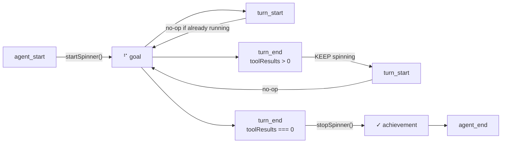

# ADR 0003: Spinner Continuity Across Tool-Call Turns

## Status
Accepted

## Context
After implementing ADR 0002, the Braille spinner (`⠋`) worked for single-turn responses but visibly **stopped** during multi-turn tool-call sequences. The event flow during a tool-call turn looks like this:

```
agent_start → turn_start → [LLM calls tools] → turn_end → turn_start → [LLM responds]
```

The original `turn_end` handler unconditionally called `stopSpinner()` and rendered the achievement prefix (`✓`). This meant:

1. **Visual flicker**: The spinner stopped at `turn_end`, showed `✓` for a split second, then restarted at the next `turn_start`.
2. **Misleading UX**: The checkmark prefix appeared while the agent was still actively working (just waiting for tool results).
3. **Animation felt broken**: Users reported the "thinking animation stops after tool calls" — it wasn't broken, it was being deliberately stopped on every intermediate turn.

## Root Cause Analysis

The `TurnEndEvent` carries `toolResults: ToolResultMessage[]`. When `toolResults.length > 0`, the turn was an **intermediate** step where the LLM requested tool execution and is waiting to process the results in a subsequent turn. Only when `toolResults.length === 0` is the turn truly **final** — the agent has finished processing and will fire `agent_end` next.

The original code ignored this signal:

```typescript
pi.on("turn_end", (event, ctx) => {
  stopSpinner();                       // ❌ Always stops
  renderWidget(ctx, goal, "achievement"); // ❌ Always shows ✓
  // ... async achievement summarize ...
});
```

## Decision

Distinguish intermediate vs final turns using `event.toolResults.length`:

| Turn Type | `toolResults` | Spinner | Achievement Render | Async Summarize |
|-----------|---------------|---------|-------------------|-----------------|
| **Intermediate** | `> 0` | **Keep running** | Skip | Skip |
| **Final** | `=== 0` | Stop at `turn_end` | Show `✓` goal | Run |

### Implementation

#### 1. `turn_end` handler — conditional behavior

```typescript
const hasToolResults = event.toolResults && event.toolResults.length > 0;

if (!hasToolResults) {
  // Final turn
  stopSpinner();
  if (existing?.goal) renderWidget(ctx, existing.goal, "achievement");
}
// Intermediate turns keep spinner running across the turn_end → turn_start gap

if (hasToolResults) return; // Skip achievement summarization for tool requests

// Only run async summarizeAchievement for final turns...
```

#### 2. `startSpinner()` — interval deduplication

`turn_start` unconditionally called `renderWidget(ctx, goal, "working")`, which called `startSpinner()`, which cleared and recreated the `setInterval` on every turn boundary. This thrashed the interval and could cause frame-skipping.

Added an early-return guard:

```typescript
function startSpinner(ctx, text) {
  if (spinnerTimer && currentSpinnerText === text) {
    // Already running with same text — don't thrash between turn_start events
    return;
  }
  // ... create interval
}
```

### Event Flow (Multi-Turn Tool Calls)



### Why Skip Achievement Summarize on Intermediate Turns?

The assistant message in an intermediate turn is typically a tool request ("Let me search for that…" or a reasoning/thinking block), not an actual accomplishment. Running `summarizeAchievement()` on it would:

- Waste an LLM call (the achievement would be discarded on the next turn anyway)
- Produce meaningless summaries like "Requested tool execution"
- Add latency to the already-busy tool-call gap

Achievement summarization is only meaningful on the **final** turn, where the assistant's message represents the actual deliverable to the user.

## Consequences

- **Positive:** The spinner now runs continuously across all tool-call turns. Users see a smooth, uninterrupted "thinking" animation from `agent_start` through every intermediate turn until the final response.
- **Positive:** No misleading `✓` prefix during tool execution. The checkmark only appears when the agent is genuinely done.
- **Positive:** Fewer wasted LLM calls. Achievement summarization only runs once per agent run, on the final turn.
- **Positive:** `startSpinner()` deduplication reduces `setWidget()` call volume and prevents interval thrashing.
- **Negative:** Slightly more complex `turn_end` logic. The handler now branches on `toolResults` length, adding one more state to reason about.
- **Negative:** If a tool-call turn's assistant message contains meaningful work (e.g., "I've analyzed the codebase and found 3 issues" before calling an edit tool), that intermediate text is not captured as an achievement. Only the final turn's output becomes the achievement. This is intentional — intermediate messages are usually transitional, not accomplishments.

## Related

- [ADR 0001: Anti-Ghosting Widget](0001-anti-ghosting-widget.md) — Why we use plain-text `setWidget()` instead of pi-tui components.
- [ADR 0002: Widget Phase Indicators](0002-widget-phase-indicators.md) — Original spinner implementation that this ADR refines.
